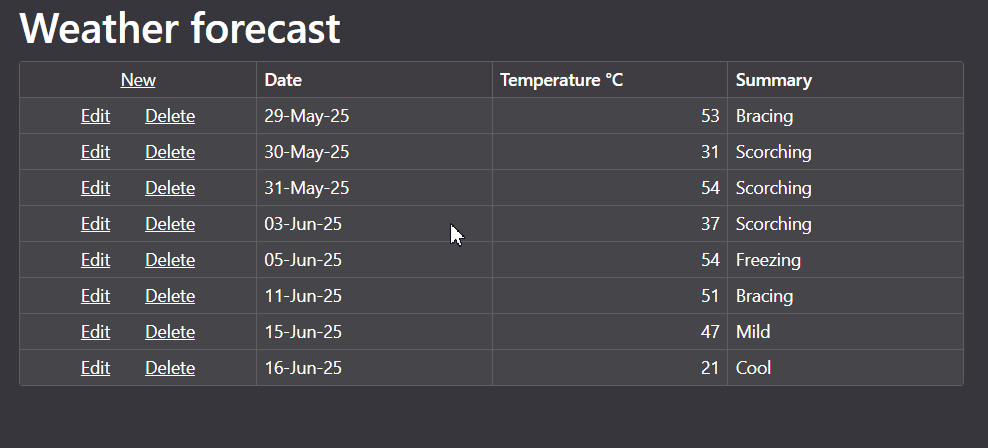

<!-- default badges list -->

[](https://supportcenter.devexpress.com/ticket/details/T1292610)
[](https://docs.devexpress.com/GeneralInformation/403183)
[](#does-this-example-address-your-development-requirementsobjectives)
<!-- default badges end -->
# Blazor Grid - Binding to an ExpandoObject Collection with Editing Support

The DevExpress [Blazor Grid](https://docs.devexpress.com/Blazor/403143/components/grid) allows you to bind it to a collection of `ExpandoObject` with full editing capabilities, including row creation, editing, and deletion.



## Key Features

- Dynamic data binding using `ExpandoObject`
- Full editing support:
  - Inline editing with custom templates for `DateOnly`, `int`, `string` and other built-in types. 
  - New row creation via the `CustomizeEditModel` event.
  - Row update and delete operations with `EditModelSaving` and `DataItemDeleting` events.

## Implementation Details

### 1. Display the data in a DxGrid
The DxGrid is bound to an ExpandoObject Collection. Each column includes a custom [CellEditTemplate](https://docs.devexpress.com/Blazor/DevExpress.Blazor.DxGridCommandColumn.CellEditTemplate) with an editor bound to the ExpandoObject via `IDictionary<string, object>`.
```razor
<DxGridDataColumn Caption="Date" FieldName="Date">
    <CellEditTemplate>
        @{
            var editItem = (IDictionary<string, object>)context.EditModel;
            var date = (DateOnly)editItem["Date"];
        }
        <DxDateEdit Date="@(date)"
                    DateChanged="@((DateOnly newVal) => editItem["Date"] = newVal)"
                    DateExpression="@(() => date)">
        </DxDateEdit>
    </CellEditTemplate>
</DxGridDataColumn>
```
### 2. Handle edit model customization
Create your own editing model in the [CustomizeEditModel](https://docs.devexpress.com/Blazor/DevExpress.Blazor.DxGrid.CustomizeEditModel) event handler:
```cs
private void Grid_CustomizeEditModel(GridCustomizeEditModelEventArgs e) {
    if (e.IsNew) {
        dynamic forecast = new ExpandoObject();
        forecast.Id = Guid.NewGuid();
        forecast.Date = DateOnly.FromDateTime(DateTime.Now.AddDays(1));
        forecast.TemperatureC = 0;
        forecast.Summary = "";
        e.EditModel = forecast;
    }
}
```

### 4. Save changes 
Handle the [EditModelSaving](https://docs.devexpress.com/Blazor/DevExpress.Blazor.DxGrid.EditModelSaving). In the event handler, retrieve data from your custom edit model to update the corresponding ExpandoObject item:
```cs 
private async Task Grid_EditModelSaving(GridEditModelSavingEventArgs e) {
    if (e.IsNew) {
        forecasts.Add((ExpandoObject)e.EditModel);
    } else {
        dynamic editableForecast = (ExpandoObject)e.EditModel;
        dynamic originalForecast = forecasts
            .Cast<dynamic>()
            .First(s => (Guid)s.Id == (Guid)editableForecast.Id);
        originalForecast.Date = editableForecast.Date;
        originalForecast.TemperatureC = editableForecast.TemperatureC;
        originalForecast.Summary = editableForecast.Summary;
    }
}
```

### 5. Delete rows
In the [DataItemDeleting](https://docs.devexpress.com/Blazor/DevExpress.Blazor.DxGrid.DataItemDeleting) event handler, remove the item from the collection.
```cs
private async Task Grid_DataItemDeleting(GridDataItemDeletingEventArgs e) {
    forecasts.Remove((ExpandoObject)e.DataItem);
}
```


## Files to Review

- [Index.razor](./CS/Expando/Components/Pages/Index.razor)
- [WeatherForecastService.cs](./CS/Expando/Services/WeatherForecastService.cs)
- [Program.cs](./CS/Expando/Program.cs)

## Documentation

- [Bind Blazor Grid to Data](https://docs.devexpress.com/Blazor/403737/components/grid/bind-to-data)

## More Examples

- [WPF Data Grid - Bind to Dynamic Data](https://supportcenter.devexpress.com/ticket/details/t1091075/wpf-data-grid-bind-to-dynamic-data)
<!-- feedback -->
## Does this example address your development requirements/objectives?

[](https://www.devexpress.com/support/examples/survey.xml?utm_source=github&utm_campaign=blazor-grid-expandoobject&~~~was_helpful=yes) [](https://www.devexpress.com/support/examples/survey.xml?utm_source=github&utm_campaign=blazor-grid-expandoobject&~~~was_helpful=no)

(you will be redirected to DevExpress.com to submit your response)
<!-- feedback end -->
